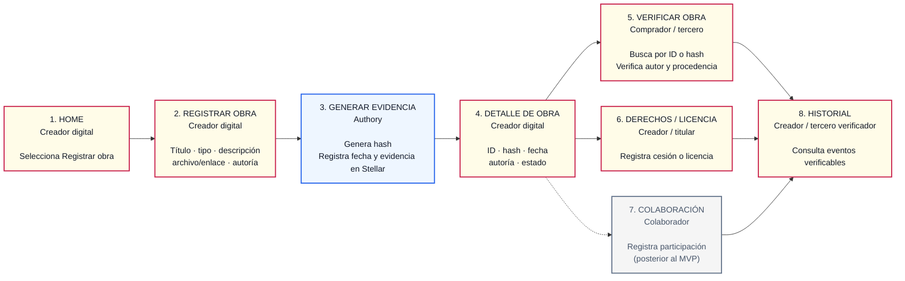

# Product Blueprint

**Nombre del proyecto:** Authory

**Repositorio (enlace obligatorio):** [Authory](https://github.com/nidaela/Authory)

> Los campos marcados como *enlace obligatorio* deben ir como enlace en Markdown, con este formato: `[texto del enlace](https://...)`. Reemplacen el texto y la dirección de ejemplo.

---

## Contenido

1. Priorización de historias
2. Propuesta de valor
3. Flujo de usuario
4. Alcance del MVP
5. Lean Canvas
6. Backlog priorizado (Kanban)
7. Arquitectura inicial
8. Uso de Stellar y justificación

---

## 1. Priorización de historias

> Historias elegidas entre las que propuso el equipo y criterio con que se priorizaron. Son las que pasan al backlog. Extensión: breve.

**Criterio de priorización:** Escriban aquí el criterio (por ejemplo, imprescindible / debería / podría / queda fuera).

| Prioridad | Historia | Propuesta por | Por qué entra al backlog |
| :---: | --- | :---: | --- |
| 1 | Como [rol] quiero [acción] para [beneficio]. | Nombre | Escriban aquí su respuesta. |
| 2 | Como [rol] quiero [acción] para [beneficio]. | Nombre | Escriban aquí su respuesta. |
| 3 | Como [rol] quiero [acción] para [beneficio]. | Nombre | Escriban aquí su respuesta. |
| 4 | Como [rol] quiero [acción] para [beneficio]. | Nombre | Escriban aquí su respuesta. |
| 5 | Como [rol] quiero [acción] para [beneficio]. | Nombre | Escriban aquí su respuesta. |

*(Agreguen o borren filas según las historias que pasen al backlog.)*

---

## 2. Propuesta de valor

> Qué resultado obtiene el usuario y por qué elegiría esta solución. En qué se diferencia de cómo resuelve hoy. Conecta con el usuario del Problem Brief. Extensión: 150–300 palabras en total.

**Usuario (del Problem Brief):** Creadores digitales —como diseñadores, ilustradores, músicos, programadores y otros productores de contenido digital— que necesitan demostrar de forma confiable la autoría y fecha de creación de sus obras. También compradores, clientes y terceros que necesitan verificar su origen y conocer quién tiene derecho a utilizarlas o transferirlas.

**Resultado que obtiene:** Authory permite registrar una obra digital con una evidencia verificable de quién la creó y cuándo, y conservar un historial de eventos posteriores relacionados con sus derechos. Esto permite distinguir al autor original de quienes posteriormente reciben, adquieren o utilizan determinados derechos sobre la obra.

**Por qué elegiría esta solución:** Porque reúne en un mismo historial información que hoy puede estar distribuida entre archivos, correos, repositorios, publicaciones y documentos separados. Para el creador, facilita demostrar el origen de su obra; para compradores y terceros, permite verificar información relevante antes de utilizarla o adquirirla, reduciendo incertidumbre y el esfuerzo de reconstruir evidencias dispersas.

**En qué se diferencia de cómo lo resuelve hoy:** Actualmente la autoría y las transferencias de derechos suelen demostrarse recurriendo a diferentes fuentes que no necesariamente forman un historial continuo. Authory propone conectar el registro inicial de la obra con eventos posteriores en una secuencia verificable que distintos actores puedan consultar, sin depender exclusivamente de una única plataforma o intermediario para reconstruir qué ocurrió con la obra.

---

## 3. Flujo de usuario

> Recorrido de la persona por la solución de principio a fin, roles y puntos de interacción. Diagrama o secuencia numerada. Extensión: 150–300 palabras.
El recorrido principal comienza cuando un creador digital registra una obra en Authory. La plataforma recibe la información básica, genera una huella criptográfica y registra evidencia verificable asociada a la autoría y fecha mediante Stellar. Después, el creador puede consultar el registro generado y compartir su identificador.

Un comprador o tercero puede verificar públicamente la obra mediante su ID o hash y consultar su autor original, fecha de registro y procedencia. Si posteriormente existe una cesión o licencia, el titular puede registrar ese cambio para mantener actualizado el historial de derechos. Las colaboraciones y versiones se consideran extensiones posteriores del flujo principal. Finalmente, los actores pueden consultar el historial de eventos verificables relacionados con la obra.

Este recorrido permite separar las acciones del creador, las consultas de terceros y los procesos internos de Authory. El registro inicial y la verificación forman el núcleo del MVP, mientras que la gestión de derechos amplía su valor al conservar eventos posteriores asociados a la obra. La colaboración y el versionado quedan planteados como extensiones posteriores para evitar aumentar innecesariamente el alcance inicial del producto.

| Paso | Rol | Qué hace | Punto de interacción |
| :---: | :---: | --- | --- |
| 1 | Creador digital | Ingresa a Authory y selecciona Registrar obra. | Página principal |
| 2 | Creador digital | Ingresa título, tipo, descripción, archivo o enlace y datos de autoría. | Pantalla Registrar obra |
| 3 | Sistema (Authory) | Genera el hash y registra evidencia verificable de autoría y fecha. | Backend + Stellar |
| 4 | Creador digital | Consulta el registro generado, su ID, hash, fecha, autoría y estado. | Pantalla Detalle de obra |
| 5 | Comprador / tercero | Busca la obra mediante ID o hash y comprueba autor, fecha y procedencia. | Pantalla pública Verificar obra |
| 6 | Creador / titular | Registra una cesión o licencia cuando cambian los derechos de uso.| Pantalla Derechos / Licencia |
| 7 | Colaborador | Registra su participación en una obra cuando corresponde. Esta función puede incorporarse después del MVP. | Pantalla Colaboración |
| 8 | Creador / tercero verificador | Consulta el registro inicial y los eventos posteriores relacionados con la obra. | Pantalla Historial |

---

## 4. Alcance del MVP

Funcionalidad central separada de la deseable que queda fuera. Justificación de por qué el recorte sigue entregando valor. Extensión: 150–300 palabras en total.

| Dentro del MVP (funcionalidad central) | Fuera del MVP (deseable, para después) |
| :--- | :--- |
| Registro de obras con generación de huella criptográfica (hash) y sellado de tiempo inmutable en Stellar. | Gestión de coautorías complejas con porcentajes de participación y validación multifirma entre colaboradores. |
| Verificación pública por ID o archivo para comprobar autor original, fecha e integridad sin necesidad de cuenta. | Control de versiones ramificadas, derivados y actualizaciones de contenido de la obra. |
| Historial básico de eventos para registrar y consultar transferencias de derechos o licencias de uso. | Sistema de notificaciones automáticas y alertas por correo ante cambios en los derechos. |
| Generación de certificado descargable y enlace único verificable para compartir evidencias con terceros. | Pasarela de pagos integrada y marketplace para la comercialización directa de licencias. |

**Por qué el recorte sigue entregando valor:** El recorte se enfoca en resolver la necesidad más crítica de los creadores: demostrar de forma irrefutable quién creó una obra y cuándo, protegiéndola contra el plagio sin comprometer su contenido privado. Al posponer módulos complejos como la validación multifirma en coautorías, el árbol de versiones y las pasarelas de pago, Authory reduce la fricción de adopción y concentra su esfuerzo en la robustez del registro en Stellar y en la verificación pública y abierta. Esto permite a diseñadores, músicos y desarrolladores contar con certeza técnica y un certificado utilizable de inmediato ante clientes y plataformas, mientras que los terceros adquieren una herramienta ágil para auditar la procedencia de una obra antes de utilizarla.

---

## 5. Lean Canvas

> Lienzo de una página con el modelo del producto. Extensión: enlace (obligatorio).

**Imagen del Lean Canvas (obligatorio):** [Lean Canvas del proyecto](https://www.figma.com/board/U3hvVidAjdO0B3OLK0c0Op/Product-Blueprint?node-id=73-320&t=qzAVazNJbNio5VZa-4)

**Lean Canvas:

El lienzo debe cubrir: problema, segmento de usuarios, propuesta de valor única, solución, canales, métricas clave, ventaja diferencial y estructura de costos e ingresos.

---

## 6. Backlog priorizado (Kanban)

> Enlace al tablero en GitHub Projects, construido con las historias priorizadas, en columnas y con criterios de aceptación por tarjeta. Extensión: enlace al tablero (obligatorio).

**Enlace al tablero (obligatorio):** [Tablero Kanban en GitHub Projects](https://github.com/users/usuario/projects/1)

---

## 7. Arquitectura inicial

> Cómo se conectan las partes (interfaz, lógica, Stellar) y en qué punto entra la red. Diagrama simple en imagen. Extensión: 150–300 palabras en total.

**Diagrama (imagen o enlace):** Escriban aquí el enlace o inserten la imagen.

| Capa | Componente | Qué hace |
| :---: | --- | --- |
| Interfaz | Escriban aquí su respuesta. | Escriban aquí su respuesta. |
| Lógica | Escriban aquí su respuesta. | Escriban aquí su respuesta. |
| Stellar | Escriban aquí su respuesta. | Escriban aquí su respuesta. |

**En qué punto entra la red:** Escriban aquí su respuesta.

---

## 8. Uso de Stellar y justificación

> Qué componentes de Stellar usaría y por qué cada uno. Apoyado en el criterio de pertinencia del Problem Brief. Extensión: 150–300 palabras en total.

**Criterio de pertinencia (del Problem Brief):** Escriban aquí el criterio en el que se apoyan.

| Componente de Stellar | Para qué lo usamos | Por qué ese y no otra alternativa |
| --- | --- | --- |
| Escriban aquí su respuesta. | Escriban aquí su respuesta. | Escriban aquí su respuesta. |
| Escriban aquí su respuesta. | Escriban aquí su respuesta. | Escriban aquí su respuesta. |
